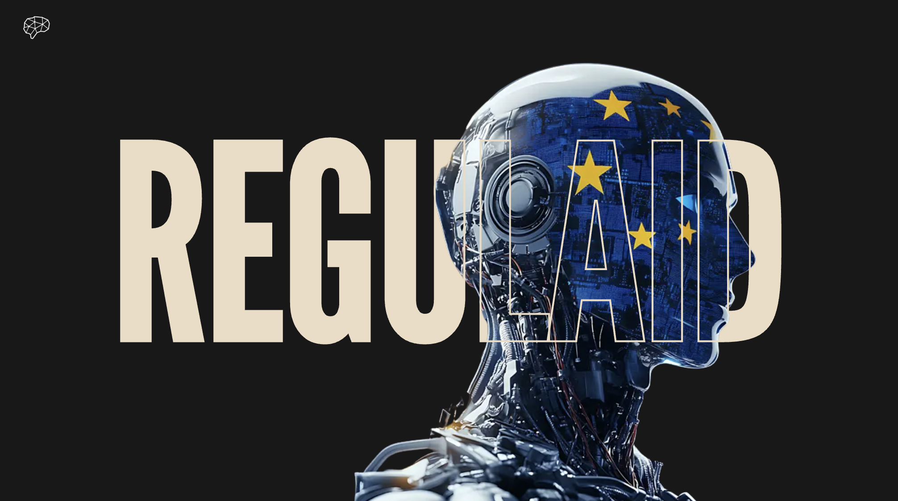
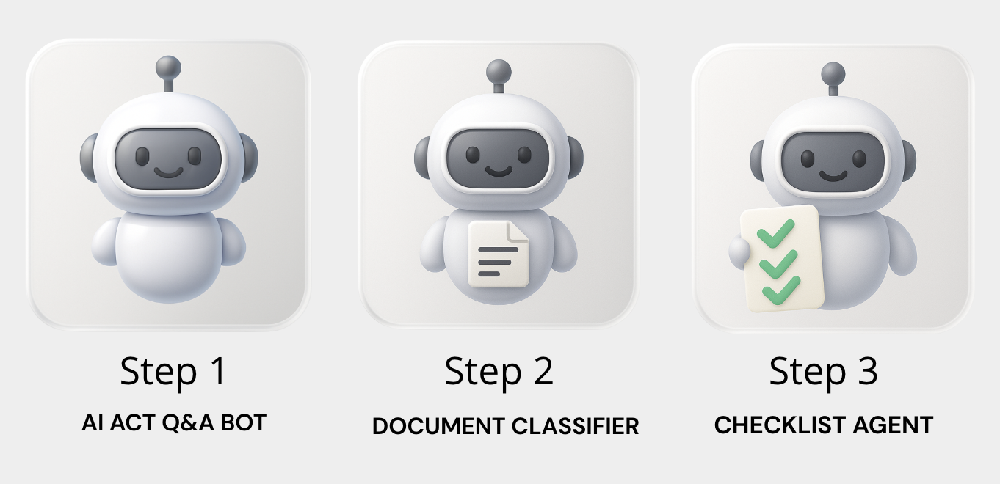
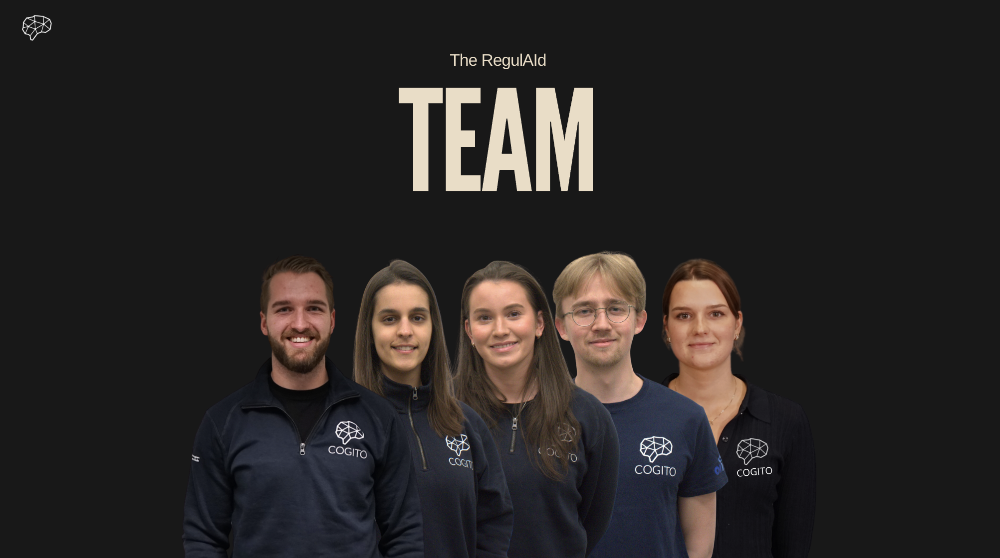

<!-- TODO: CHANGE ALL INSTANCES OF "PROJECT-TEMPLATE" IN ENTIRE PROJECT TO YOUR PROJECT TITLE-->

# RegulAId

<div align="center">


[](https://opensource.org/licenses/MIT)
[](https://img.shields.io/badge/version-0.0.1-blue)


</div>

<details>
<summary><b>📋 Table of Contents</b></summary>

<br>

| Section | Description |
|---------|-------------|
| [⭐️ Project Description](#project-description) | Overview of the RegulAId Project |
| [🛠️ Prerequisites](#️-prerequisites) | Required tools and dependencies |
| [🚀 Getting Started](#getting-started) | Step-by-step installation guide |
| [▶️ Usage](#usage) | How to run and use the application |
| [👥 Team](#team) | Meet the contributors |
| [📄 License](#license) | Licensing information |

</details>

## Project Description

**RegulAId** is an AI-powered compliance assistant that helps organizations navigate the complexity of the EU AI Act. Understanding and complying with these regulations is challenging, as they are lengthy, highly technical, and continuously evolving. The consequences of non-compliance can be severe, including substantial fines and significant reputational damage.

RegulAId transforms this challenge into an opportunity by making compliance faster, easier, and more accessible through intelligent AI agents.

### What RegulAId Does

RegulAId provides three core capabilities to streamline EU AI Act compliance:

1. **Intelligent Q&A System** - Ask questions about the EU AI Act in natural language and receive answers with precise article references and citations
2. **Automated Risk Classification** - Describe your AI system and get an instant risk assessment (Prohibited, High-Risk, Limited-Risk, or Minimal-Risk) with supporting legal reasoning
3. **Compliance Checklist Generation** - Receive a tailored, actionable compliance checklist organized by priority and category based on your system's risk level



</div>


### Key Features

- **Advanced Retrieval System**: Combines keyword search (BM25) and semantic search (vector embeddings) using Reciprocal Rank Fusion for optimal accuracy
- **Specialized AI Agents**: Purpose-built agents powered by GPT-4 that understand EU AI Act requirements and provide guidance
- **Real-Time Streaming**: Watch as agents analyze your system and build compliance plans, with live task progress updates
- **Source Citations**: Every answer includes references to specific EU AI Act articles for verification and transparency
- **Risk-Based Approach**: Aligns with the EU AI Act's four-tier risk framework to provide targeted compliance guidance

### Technologies

RegulAId uses a set of established AI techniques to provide practical compliance support:

- **Retrieval-Augmented Generation (RAG)**: Hybrid retrieval combining BM25 and vector search for accurate regulation lookup
- **LangChain Agents**: Autonomous agents with specialized tools for classification and compliance planning
- **Vector Database**: PostgreSQL with ParadeDB extensions for efficient semantic search
- **Large Language Models**: GPT-4 for natural language understanding and reasoning
- **Chain-of-Thought**: Systematic reasoning processes for complex regulatory analysis

## 🛠️ Prerequisites

- **Git**: Ensure that git is installed on your machine. [Download Git](https://git-scm.com/downloads)
- **Python 3.12**: Required for the backend. [Download Python](https://www.python.org/downloads/)
- **UV**: Used for managing Python environments. [Install UV](https://docs.astral.sh/uv/getting-started/installation/)
- **Docker & Docker Compose**: **Required** for running the ParadeDB database. [Download Docker](https://www.docker.com/products/docker-desktop)
- **Node.js** (v18+): Required for the frontend. [Download Node.js](https://nodejs.org/)
- **OpenAI API Key**: Required for GPT-4 access. [Get API Key](https://platform.openai.com/api-keys)

## Getting started

1. **Clone the repository**:

   ```sh
   git clone https://github.com/CogitoNTNU/RegulAId.git
   cd RegulAId
   ```

2. **Install backend dependencies**:

   ```sh
   uv sync
   ```

3. **Install frontend dependencies**:

   ```sh
   cd frontend
   pnpm install
   cd ..
   ```

   Note: If you don't have pnpm installed, you can use `npm install` instead.

4. **Configure environment variables**:

   Copy the example environment file and configure your settings:
   ```sh
   cp .env.example .env
   ```

   Then edit the `.env` file to include your OpenAI API key and other configuration settings.

5. **Start Docker services**:

   Start all services (database and backend) using Docker Compose:
   ```sh
   docker compose up postgres
   ```

6. **Set up the database and load EU AI Act data**:

   In a new terminal, run the database initialization script. This creates tables, indexes (HNSW, BM25), and inserts EU AI Act documents with embeddings:
   ```sh
   uv run python src/database/init_db.py
   ```

7. **Add supplementary risk classification data**:

   Add additional data about risk layers that complement the EU AI Act legislation:
   ```sh
   uv run python src/database/add_fake_chunks.py
   ```
> **Note:** The EU AI Act documents do not fully describe all risk layers in a structured way. To enable more complete and consistent risk classification of AI systems, we include supplementary risk layer data in addition to the original legislation texts.
## Usage

### Running the Application

1. **Start the backend API**:

   From the root directory:
   ```bash
   uv run uvicorn src.api.main:app --host 127.0.0.1 --port 8000 --http h11 --reload
   ```

   The API will be available at [http://127.0.0.1:8000](http://127.0.0.1:8000)

2. **Start the frontend**:

   In a new terminal, navigate to the frontend directory:
   ```bash
   cd frontend
   pnpm run dev
   ```

   The frontend will be available at [http://localhost:5173](http://localhost:5173)


### Additional Commands

#### Reset Database

If you need to reset the database:
```bash
uv run python src/database/reset_db.py
```
This drops the table. After resetting, re-run `init_db.py` to recreate the database.

#### Data Preprocessing

If you want to reprocess the EU AI Act data from scratch:

```bash
# Extract and clean PDF
uv run --with pymupdf python src/preprocessing/strip_aiact.py

# Chunk into paragraphs
uv run python src/preprocessing/chunking-paragraphs.py

# Chunk fake data
uv run python src/preprocessing/chunk_fake_data.py
```

This creates `data/processed/aiact-chunks.json` and `data/processed/fake-chunks.json`.

#### Test Retrievers

If you want to only test the retrieval system:
```bash
uv run python src/retrievers/test_retrievers.py
```

## Team

This project was built by the RegulAId team at Cogito NTNU. Thank you to everyone who contributed their hard work and dedication to making this project possible. It's been a great experience working together on this challenge.

<table align="center">
    <tr>
        <td align="center">
            <a href="https://github.com/serinaerzengin">
              <br />
              <sub><b>Serina Erzengin</b></sub>
            </a>
        </td>
        <td align="center">
            <a href="https://github.com/Ines-Trigueiro">
              <br />
              <sub><b>Inês Trigueiro</b></sub>
            </a>
        </td>
        <td align="center">
            <a href="https://github.com/rasmusjs">
              <br />
              <sub><b>Rasmus Skramstad</b></sub>
            </a>
        </td>
        <td align="center">
            <a href="https://github.com/vegardaaalbretsen">
              <br />
              <sub><b>Vegard Aa Albretsen</b></sub>
            </a>
        </td>
        <td align="center">
            <a href="https://github.com/ingunntonetta">
              <br />
              <sub><b>Ingunn Tonetta Erdal</b></sub>
            </a>
        </td>
        <!--
        Add more team members by copying the template below:
        <td align="center">
            <a href="https://github.com/USERNAME">
              <br />
              <sub><b>Full Name</b></sub>
            </a>
        </td>
        -->
    </tr>
</table>



### License

______________________________________________________________________

Distributed under the MIT License. See `LICENSE` for more information.
